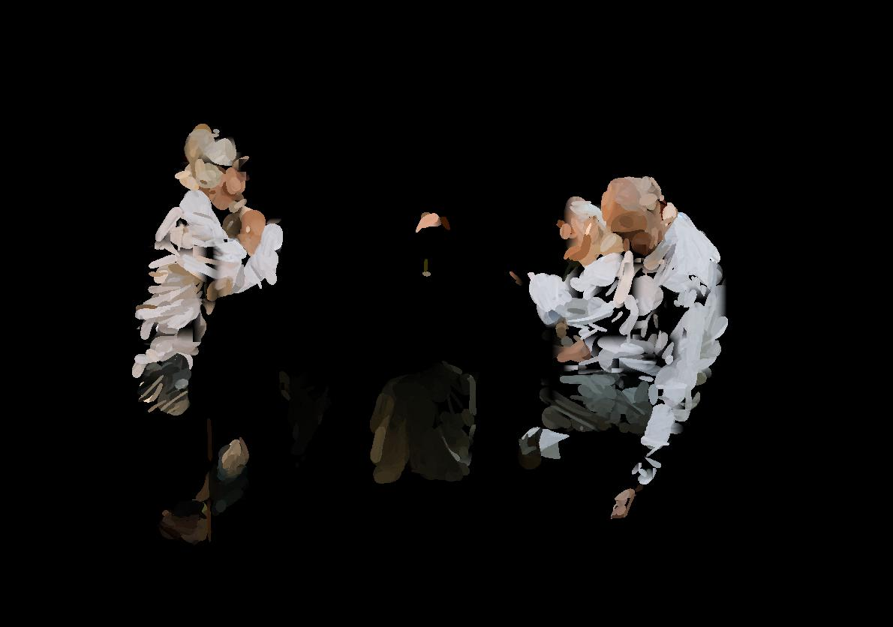
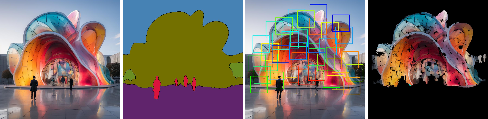
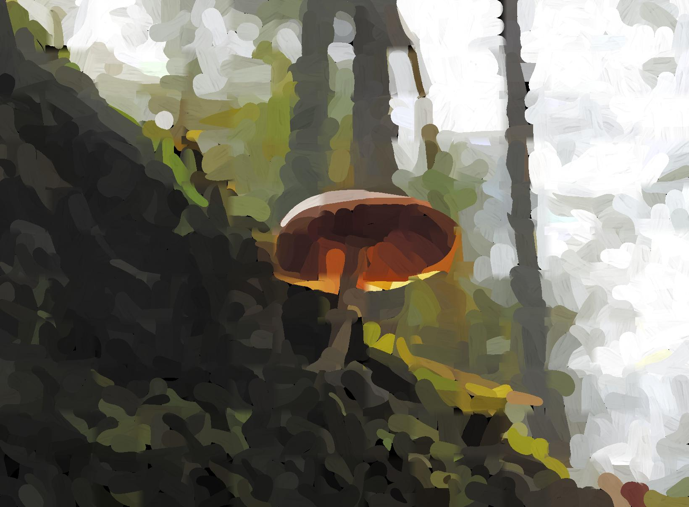
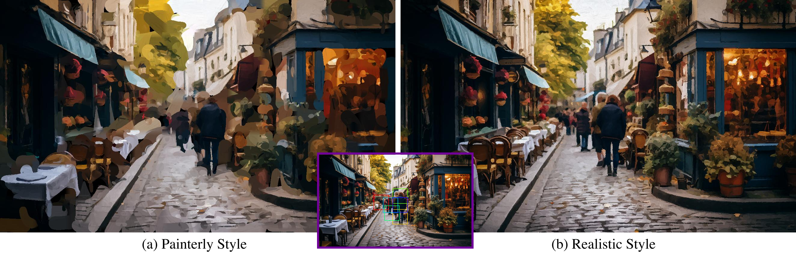

## :smiley::heart_eyes::fire::fire: Segmentation-Based Parametric Painting :fire::fire::heart_eyes::smiley:

This repository contains a semantic-based painting optimization algorithm which aims to transform a given input image into a painting. The algorithm takes advantage of modern computer vision techniques, segmentation networks, and a differentiable renderer to generate results.

[Project Website](https://manuelladron.github.io/semantic_based_painting/)


<!--  -->

## What It Does



The algorithm aims to efficiently optimize a collection of stroke parameters to create a painting from a given image input. The method starts with an image and optimizes a parameter vector of strokes. When rendered on a canvas, it recreates the input image in the form of a painting. The approach is designed to efficiently manage any input size or aspect ratio. It divides the canvas into semantic areas using a segmentation network. This provides a higher control over the painting compared to previous optimization and neural methods.

- **Layered Painting & Patch-Based Approach**: 
  - Implements a coarse-to-fine progression.
  - Uses a layered approach, starting with a rough first coarse painting pass and progressively refines.
  - Uses patches of `128x128` size and batch-optimizes all stroke parameters in each patch.

- **Semantic Segmentation**:
  - Provides precision over the granularity of each semantic zone in the artwork.
  - Ensures strokes remain within the designated semantic segment, improving the painting's accuracy.

- **Visual Working Memory**:
  - Uses a dynamic attention maps system to focus on areas that need more attention.
  - Yields an organic feel to the painting.

- **Stroke Initialization, Renderer, and Blending**:
  - Uses the stroke parameter representation and differentiable renderer.
  - Strokes are parameterized by a 13-dimensional tuple encoding various properties like start, middle, end points, radii, transparency, and RGB color.
  - Strokes are composited into patches with soft blending.

- **Optimization & Loss Functions**:
  - Optimizes all stroke parameters in batch for efficiency.
  - Uses both pixel loss and perceptual loss to ensure accurate recreation of the input image.

## How To Use

### 1. Requirements:

- Python 3.6 or later
- Install the required packages from `requirements.txt` using the following command:

```bash
pip install -r requirements.txt
```

- Download the renderer and perceptual network [here](https://drive.google.com/drive/folders/1f1dMbU5Yj9T-lGq0ZTc1MPPPJ-R7v0YX?usp=sharing) and store them in a folder under the main directory. *Update: also provided in folder model_checkpoints.

### 2. Command:

```bash
python main.py [options]
```

### 3. Arguments:

- `--exp_name`: Experiment name (default: 'exp_122_no_masks_uniform')
- `--global_loss`: Global loss strategy (default: False)
- `--texturize`: Use texturize feature (default: True)
... and many more. (For a full list of arguments and their defaults, refer to the `main.py` file)

To paint with a painterly style set style to "painterly". To get a realistic style, set it to "realistic"
- `--style`

### 4. Example:

```bash
python main.py --image_path /path/to/image.jpg --save_dir /path/to/save_directory --style painterly
```

## Method Overview

The method uses various techniques and algorithms to produce a painting from an input image. Key components include:

- **Semantic Segmentation**: Dividing the canvas into areas of interest.
- **Layered Painting**: A coarse-to-fine progression.
- **Visual Working Memory**: A dynamic attention maps system that focus on areas that need more attention.
- **Optimization & Loss Functions**: Ensuring the painting closely resembles the input image.

### Implementation Details:

- **Optimizer**: Adam with a learning rate of 0.0002.
- All painting layers are optimized for 300 iterations.
- **Canvas Background**: Black.
- **Segmentation Network**: Uses the DETR model with a CNN (ResNet) backbone followed by an encoder-decoder Transformer.


## More Results:






## References

- [Huang, et al. 2019. Learning to Paint]
- [Liu et al. 2021. Paint Transformer]
- [Zou et al. 2020. Stylized Neural Painting]
- [DETR: Carion, et al. 2020. End-to-End Object Detection with Transformers]

## Citation

@misc{deguevara2023segmentationbased,
      title={Segmentation-Based Parametric Painting}, 
      author={Manuel Ladron de Guevara and Matthew Fisher and Aaron Hertzmann},
      year={2023},
      eprint={2311.14271},
      archivePrefix={arXiv},
      primaryClass={cs.CV},
      }

## Feedback

For any queries or feedback related to the algorithm, please open an issue on GitHub or contact the authors directly.
